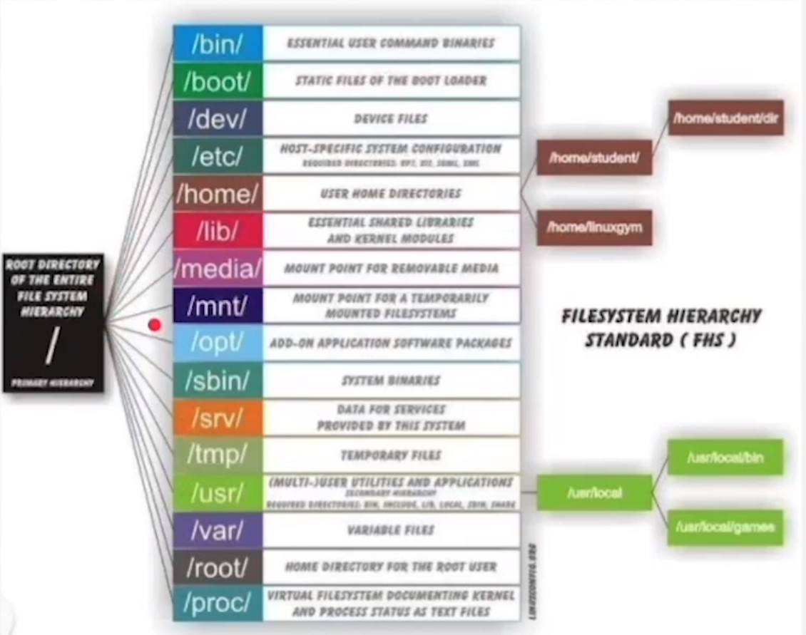

# Comandos básicos linux

~~~
adelia@ubuntu-server:~$
~~~

O "~" representa que estamos na home. o $ significa que não somos um usuário privilegiado.

1. Mostrar onde eu stou: pwd 

2. Listar conteudo (equivalente ao dir do windows): ls

3. Mostrar conteudos ocultos: ls -a

4. mostrar conteudos com longlist (melhor visualização e mais detalhamento): ls -al

<strong> podemos utiliazar o ll equivalente ao comando acima </strong>

5. limpar tela: clear ou ctrl + l

6. pedir ajuda e ver mais comandos: --help

7. Ver as paginas do manual: man "nome do comando" ex: man ls

8. cd caminho: para navegar entre os diretorios

9. apenas cd para acessar o nome

10. se fizermos cd /, podemos ir para qualquer diretorio listado a seguir

11. faz switch entre relatorio que estou e anterior: cd -

12. acessar diretorio pai: cd ..

# Criação de arquivos e diretorios

1. criando diretorio: mkdir nomedodiretorio

2. criando direotrio dentro de direotiro: mkdir -p dir1/dir2/dir3/dir5

3. voltando varias vezes: cd ../../../

4. criando arquivo: touch nomearquivo

5. cd ~/desenvolve23

6. apagar diretorio vazio: rmdir nomedodiretorio

7. apagar arquivo: rm nomearquivo

8. apagar diretorio cheio a partir do que eu estou: rm -r nomedodiretorio (o r representa recursividade)

9. a opção acima, ainda pode apresentar restricoes. mas o comando a seguir nao: rm -rf dir1/
ou tudo rm -rf *

10. criando diretorios que possui espaco no nome: mkdir diretorio\ 2

11. colando uma copia de dir1 no dir2: cp -r dir1 dir2

12. copiando apenas conteudo de dir1: cd dir1
cp -r * ../dir2

ou ainda

cp -r dir1/* dir2

# Movendo conteuos

1. renomear o nome do diretorio1: mv dir1 dir4

2. se dir4 ja existir, o comando acima move conteuo de dir1 para dir4

3. history histoico de comandos

