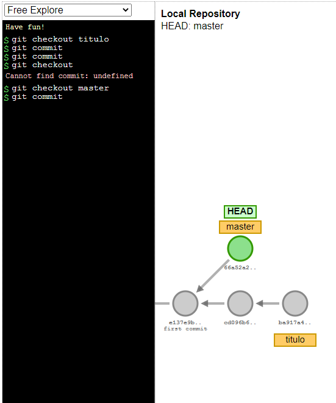
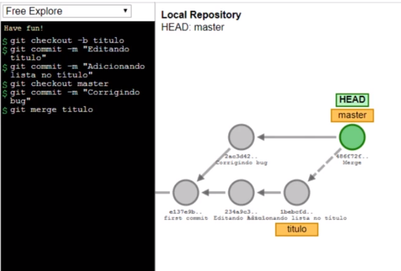

# Branches 

Sobre este trabalho compartilhado, temos dois usuários, Vinicius e Ana, desenvolvendo o mesmo projeto, e normalmente duas pessoas diferentes trabalham em partes diferentes de um projeto. Sabemos, no entanto, que este tal de master está sendo compartilhado entre eles, então, para evitarmos complicações e, enquanto o Vinicius estiver trabalhando no cabeçalho da página, por exemplo, e a Ana na lista de cursos, seria interessante termos uma maneira de separar os ramos de desenvolvimento para sabermos exatamente no que cada um está mexendo, e para que não haja interferências no código compartilhado.

Talvez isto não tenha ficado tão claro, mas consideremos o seguinte: o Vinicius passará a trabalhar em tudo que estiver contido entre as tags <head> do arquivo index.html. Então, informaremos ao nosso controle de versões que, a partir de um determinado commit, um dos usuários alterará apenas um trecho específico, enquanto o outro usuário informará do seu trecho em desenvolvimento, também.

Estas ramificações do trabalho são uma das formas de com que podemos trabalhar, em relação aos branches do Git. Por padrão, se executarmos git branch no Git Bash, teremos um único branch, master, e é exatamente isto que o Git Bash nos mostra ao fim da linha. No entanto, poderemos criar outros. No caso de trabalharmos somente no título, por exemplo, utilizaremos o comando git branch titulo, que criará este branch, embora tenhamos que mudar para ela manualmente, com git checkout titulo.

A partir daí, estaremos trabalhando na linha de desenvolvimento titulo. Para isso ficar um pouco mais claro, utilizaremos uma ferramenta chamada Visualizing(https://git-school.github.io/visualizing-git/) Git. Do lado esquerdo da página digitaremos os comandos, e o resultado destes serão exibidos do lado direito. Em se tratando do trabalho conjunto de Ana e Vinicius, teremos duas linhas de desenvolvimento distintas e independentes entre si.

Abriremos o VS Code e alteraremos o título, de <title>Cursos da Alura</title> para <title>Cursos de DevOps da Alura</title>. No Git Bash, estamos logados como Vinicius, e em titulo. Executaremos git status, verificaremos que há uma alteração, que adicionaremos com git add index.html, seguido de git commit -m "Alterando título da página".

Desta vez, se utilizarmos git log, dentre as informações que o comando nos traz, estão todos os commits realizados, incluindo o último, que é indicado como sendo o último commit realizado na master. O commit do título alterado só aparece na branch titulo, e se fizermos outra alteração no mesmo título, e refizermos todo o processo de adição, commit e verificação do log, teremos que até a mensagem "Renomeando curso de Integração Contínua" é feito na master.

Assim, somente a branch titulo possui as alterações feitas a partir de "Alterando título da página". Se precisarmos alterar algo no commit de "Renomeando curso de Integração Contínua", que não é influenciado pelo título, basta utilizarmos git checkout master para retornarmos à branch correspondente.

Feito isso, ao executarmos git log, não teremos acesso àqueles commits em titulo. Isso é bem interessante! Usaremos git checkout titulo para voltarmos, e passaremos a lidar com a Ana, que trabalhará com as listas de cursos. Criaremos, portanto, um branch com git branch lista, e depois faremos o checkout para a lista.

Entretanto, existe um atalho que cria um branch e já passar para ele: git checkout -b lista, que usaremos. Com isso, a Ana está na branch lista, então poderemos abrir o projeto da Ana no VS Code e adicionar um curso em uma nova lista, como <li>Kubernetes</li>, junto aos demais. No Git Bash, digitaremos git status, verificaremos que há uma modificação, adicionaremos todas elas com git add ., e commitaremos com git commit -m "Adicionando curso de kubernetes".

Assim, a Ana e o Vinicius estão trabalhando ao mesmo tempo em branches independentes de um mesmo projeto. Mas sabemos que em nosso repositório chamado local, por enquanto, temos apenas a branch master. Isso nos leva a assumir que esta branch é a nossa linha de desenvolvimento padrão, ou seja, nosso ramo principal, onde os códigos devem estar quando estiverem prontos, certo?

Então, como será que fazemos para trazer os dados das branches titulo e lista para a master?

# Ramos

 Branches ("ramos") são utilizados para desenvolver funcionalidades isoladas umas das outras. A branch master é a branch "padrão" quando você cria um repositório.

É interessante separar o desenvolvimento de funcionalidades em branches diferentes, para que as mudanças no código, para um ramo, não influencie no funcionamento de outro.

# Unindo o trabalho

Estamos entendendo como trabalhar com linhas de desenvolvimento diferentes, mas como é que conseguiremos trazer o trabalho que fizemos em uma delas para outra? Porque, recapitulando, eu, como Vinicius, tenho duas branches, titulo e master, e trabalhamos na primeira. Porém, no repositório que se encontra na pasta "servidor", só temos a branch master, então sabemos que esta linha é a principal, onde queremos depositar o código que funciona.

Iremos trabalhar na titulo, mas em algum momento precisaremos trazê-la para a master. Na ferramenta Visualizing Git criaremos a branch titulo e passaremos a trabalhar nela, com git checkout -b titulo. Faremos um commit com git commit -m "Editando título", e outro, com git commit -m "Adicionando lista no título".

Temos um problema: reparem que nosso curso de Docker na listagem de index.html está com este nome, mas deveria estar como "Docker: Criando containers sem dor de cabeça", e precisaremos corrigir isto. Isso, porém, não tem nada a ver com nossas alterações de títulos, que não está finalizada. Então precisaremos retornar à master e, a partir daí, corrigir o bug.

Utilizaremos git checkout master, e depois git commit -m "Corrigindo bug". Agora, sim, poderemos voltar à branch titulo e finalizá-lo. Analisando com calma, porém, entendemos que esta branch já está finalizada. Então, de que forma trazemos este trabalho, os dados desta linha em específico, para a que contém head e master?

Ou seja, queremos unificar estas duas linhas, portanto usaremos o comando git merge titulo, e isto fará com que o Git automaticamente crie um commit com o branch atual e todo o conteúdo de nossa branch titulo. Na prática, estando logados como Vinicius, o que acontece é que, ao surgimento de um bug, as alterações de titulo não podem influenciar nesta correção de bug.

Sendo assim, retornaremos à master, branch que não contém as alterações referentes a titulo. Após a alteração no projeto, faremos a adição e o commit normalmente, no Git Bash, e por fim executaremos git merge titulo, como visto anteriormente. Quando dermos um "Enter", será criado um commit de merge, ou seja, de junção de duas branches. Poderemos editar a mensagem exibida, mas caso não queiramos, para salvarmos e confirmarmos a mensagem, pressionaremos ":x + Enter" no editor Vim.

Feita a junção, passamos a ter, na branch master, os dados do título alterado. Porém, se executarmos git log, não teremos os dois commits separadamente, e sim um referente ao merge. O Git cria isto para nós. Então, como será que poderemos fazer com que, em vez do Git criar este commit, ele pegue os dois commits e os adicione em nossa branch master?

Como faremos com que ele mova estas branches e atualize a master apenas com os dois commits, sem criar um de merge? Veremos isto a seguir!

# Atualizando a branch

Anteriormente, vimos como unir o trabalho de duas branches desenvolvidas separadamente. No entanto, não queremos gerar um commit a mais, de merge, dependendo da estratégia utilizada para gerar os commits, isto pode acabar atrapalhando ou "poluindo" o log. Assim, o que queremos é atualizar a branch master com os commits da branch titulo, de modo a termos cada commit específico na linha de desenvolvimento master.

Na ferramenta Visualizing Git executaremos clear para limparmos a tela, e repetiremos o processo com git checkout -b titulo para gerarmos dois commits (git commit duas vezes). Na branch master, corrigimos um bug, portanto geraremos outro commit. E então, da branch titulo, queremos trazer os demais commits para antes de master atualizando as duas branches.

Para isto, estando na master, queremos basear esta branch em titulo, assim, executaremos git rebase titulo, e o Git pegará os commits na branch titulo, atualizando master, que possui todos os commits contidos em titulo, além do commit que havia nela mesma. Deste modo, geramos uma única linha, sem confusões.

No Git Bash, executaremos git log novamente, e teremos a informação de commit de merge; de que forma conseguiremos visualizar isso de forma mais interessante? Se digitarmos git log --graph, serão exibidas linhas específicas representando o desenvolvimento, uma boa alternativa ao Visualizing Git.

Vamos fazer uma alteração na branch titulo, com git checkout titulo, e no VS Code alteraremos a primeira letra de "Cursos" para que fique em maiúscula. Adicionaremos o arquivo e o commitaremos, e depois iremos à branch master para trazermos os commits de titulo para ela, por meio de git rebase titulo.

Ao executarmos git log mais uma vez, teremos o commit "Corrigindo nome do curso de Docker" acima de "Cursos com letra maiúscula", porque ele foi adicionado logo antes. Isto é, o commit que fizemos na branch titulo foi adicionado logo antes do commit feito em master, exatamente como vimos no Visualizing Git.

Ou seja, o rebase atualiza a branch, mantendo o trabalho dela como sendo o último, para que não se gere este tipo de confusão. Com isso, temos as correções realizadas tanto no título quanto na lista, e poderemos fazer o git push local master, logados como Vinicius. Tudo está atualizado! Podemos, então, nos logar como Ana, usar git checkout master e git pull local master para atualizar os dados também.

Mas lembram que a Ana estava trabalhando em lista? Voltaremos para lá com git checkout lista para atualizarmos os dados, no caso, o título do curso de Docker. Commitaremos, faremos git log -p para garantir que a atualização foi feita, faremos um checkout para master. Teremos que houve uma alteração feita pelo Vinicius, e outra feita pela Ana, na mesma linha. O que será que acontecerá se tentarmos juntar o trabalho deles?