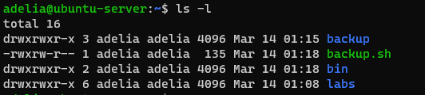

# Permissionamento de usuarios

* coluna 1: diretorio ou arquivo. Se começa com d, diretorio. Se não consegue, é arquivo. Note que diretório ou arquivos só podem ter 1 dono e so pertecem a unico grupo. Se começa com l, é um link simbolico

* coluna 2: usuario

* coluna 3: grupo. Todos que estao em grupo podem acessar o arquivo.

* e o permissionamento?
`drwxrwxr-x`

d-> diretorio

rwx-> read, escrita, execução

Em ordem: usuario, grupo, outros

Nessa imagem, pense nos numeros em binario. exemplo: 5 corresponde a 101. Logo, seria a permissao r-x.

Em diretórios, o x diz respeito a entrar no diretório. 

# links simbolicos (semelhante ao atalho)

`ln -s /projetos projetoteste`

Em Python, um link simbólico (também conhecido como symlink) é um tipo de arquivo especial que contém um caminho que aponta para outro arquivo ou diretório em um sistema de arquivos. Em outras palavras, ele é um atalho para outro arquivo ou diretório.

Em termos técnicos, um link simbólico é um arquivo que contém o caminho do arquivo ou diretório que está sendo apontado. Quando você acessa o link simbólico, ele redireciona você para o arquivo ou diretório que está apontando. Isso é diferente de um "hard link", que é um tipo de link que aponta diretamente para o bloco de dados de um arquivo.

O Python tem uma biblioteca padrão os que permite trabalhar com links simbólicos. Por exemplo, você pode criar um link simbólico para um arquivo ou diretório usando o método os.symlink(). Aqui está um exemplo de código que cria um link simbólico chamado my_link que aponta para um arquivo chamado my_file.txt:
