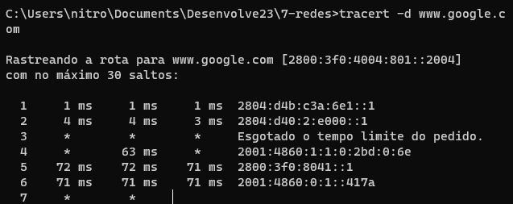

# Conceito

O primeiro ponto que precisamos entender é justamente o conceito de rede. Uma rede de computadores é formada por um conjunto de máquinas eletrônicas com processadores capazes de trocar informações e partilhar recursos

 Por exemplo, estamos na cidade de São Paulo e acesso o site do Google. Será que existe uma conexão direta entre a minha máquina e a do Google? Não, caso contrário seria necessário fazer o mesmo em todas as máquinas do mundo, o que seria completamente inviável. O que acontecerá na verdade, é que a requisição enviada para a máquina do Google passará por várias máquinas intermediárias espalhadas em diversas regiões e estas serão responsáveis por encontrar uma forma de levar a informação para a máquina do Google. Já a máquina do Google perceberá que queremos acessar o seu serviço e devolverá a informação para as máquinas intermediárias até chegar finalmente no meu computador.

As diversas máquinas que estão interconectadas em diferentes pontos, capazes de transportar as informações, é o que caracterizam a nossa rede. As redes existem em diversos tamanhos. Desde um ambiente doméstico, em que temos dois computadores e uma impressora, até grandes corporações com centenas de usuários, máquinas potentes com servidores, até a mais famosa, a internet.

# Ping

Dentro da ferramenta administrativa do ping temos o protocolo ICMP, sendo ele o responsável por mandar uma requisição (Echo Request) para máquina remota e esperar um retorno dessa máquina remota (Echo Reply).

Observe que quando digitamos no browser www.google.com.br, o site do Google aparecerá na tela.

Mas como o meu computador consegue identificar a máquina do Google? Deve existir uma forma de identificação dessas máquinas.

Vamos lembrar como era alguns anos atrás quando ainda enviávamos cartas: por exemplo, eu gostaria de enviar uma carta para o meu irmão Ricardo que mora na avenida Paulista. Para isto, eu escrevia no envelope que a carta era destinada para o meu irmão Ricardo e qual era o endereço, no caso Avenida Paulista. Quando eu entregasse a carta nos Correios, o carteiro teria como saber onde entregar. No mundo da internet, o processo de identificação será parecido. O processo de identificação das máquinas é chamado de endereçamento IP. Vamos ver como ele funciona.

Abriremos o pesquisar do computador, e digitaremos cmd e abrir o Terminal. Depois, usaremos o seguinte comando `ipconfig `

Observe que eu receberei uma série de informações do Terminal.

O número sinalizado é o IP da máquina que está sendo utilizada por mim, na gravação deste curso. Trata-se da identificação da máquina. O Google também terá um número com um formato parecido com este, que identificará essa máquina do Google.

Nós conseguimos acessar o site do Google, é razoável concluirmos que existe uma conectividade com essa máquina. Nos casos em que não temos uma conectividade com uma máquina, como conseguimos saber se a máquina que quero me comunicar dentro da minha rede se ela ativa ou está apta para a conexão? Para isto, existe uma ferramenta administrativa chamada ping.

No terminal, escreveremos ping. Depois, precisaremos especificar qual máquina queremos fazer o teste de conectividade, por exemplo não sabemos qual é o número de identificação do Google. No celular, os nossos contatos são salvos com um nome que iremos selecionar se quisermos fazer uma ligação. Mas a discagem não será feita para o nome do contato, mas para o número de telefone que está cadastrado. Deve haver algo parecido com este mapeamento entre nome e número na internet.

Por exemplo, quando digitamos no nosso navegador o endereço do Google, o que ocorre é uma tradução da URL para o endereçamento IP. O responsável por fazer esta tradução, o mapeamento é o chamado `servidor DNS`.

Então, de volta ao Terminal, podemos escrever o ping e a URL que queremos testar. No nosso caso, podemos testar a conectividade do Google.

`ping www.google.com.br`

Observe que ocorreu a tradução da URL, para o endereçamento IP, usado para a identificação.

Como a informação do ping trabalhará? Dentro dela existe um protocolo chamado de ICMP (uma sigla que significa, Internet Control Message Protocol), que funcionará de forma semelhante a um telefonema. É como se pegássemos um telefone e ligássemos para a máquina do Google, na esperança de que alguém atenda. Dentro da informação enviada, falaremos algo que será representado pelos 32 bytes que aparecem no retorno.

A máquina do Google respondeu, vemos pelo IP, e vemos o tempo que a informação levou do meu computador passar pela máquina do Google e retornar. Isto é chamado de tempo de ida e volta ou RTT (`Round trip time`). Para que seja feita essa conexão, precisamos passar por diversas máquina intermediárias, que podem estar configuradas de diversas formas que caracterizem o loop, porque existe várias interconexões. Imagine a situação em que a nossa informação enviada fique trafegando eternamente no loop, consumindo recursos... Iria travar tudo, Não seria algo muito bom.

Justamente por isso, o "pacote" de informação terá um tempo de vida útil e a cada passagem entre essas máquinas, ele irá decrementar em uma unidade representado pelo índice TTL (`Time to Live`). No nosso exemplo, quando a informação passar por 54 máquinas, o valor será zerado e será extinguido.

Se continuarmos a análise do ping, veremos que foram enviados quatro pacotes para a máquina do Google, que devolveu todos. Isto significa que a conectividade com a máquina está funcionando perfeitamente

O TTL é um campo de cabeçalho de pacote que é definido pelo emissor do pacote e decrementado por cada roteador ao longo do caminho que o pacote segue para seu destino. Cada roteador que processa o pacote decrementa o valor TTL em 1 e, se o valor TTL atingir zero, o pacote é descartado.

# Tracerout

No teste do ping, vimos que a conectividade com a máquina do Google foi estabelecida com sucesso. Se sabemos que passamos por várias máquinas intermediarias, será que existe alguma forma de verificar qual é a rota que a informação está fazendo, saindo do meu computador passando pelas máquinas intermediárias até chegar a máquina do Google? Existe, esta é uma ferramenta administrativa chamada Traceroute. Dentro dela, assim como no ping, teremos um protocolo chama de ICMP, que fará essas verificações para saber quais são as máquinas intermediárias que participam do processo.

Para usá-la, no Windows nós digitaremos na linha de comando (no Linux considerar traceroute -n):

`tracert -d www.google`

Usamos o -d (-n no Linux) para que ele não faça a tradução DNS.

Observe que ocorreu a mesma tradução que foi feita no ping, por meio do servidor DNS que transformou o www.google.com para o endereçamento IP da máquina do Google. Mas as informações retornadas, foram diferentes.

Na primeira coluna, teremos o número de identificação da máquina por onde passou a informação da minha máquina. Ela foi a primeira a participar no processo de envio de dados. Mas a informação ainda passará por outras máquinas.

Mas observe os três intervalos de tempo que são mostrados nas outras colunas. Eles são os mesmos do ping e se referem ao processo de envio da minha máquina até o servidor do Google e de volta. Por que recebemos três informações?

Vamos pensar um exemplo do mundo real. Quando saímos do trabalho e vamos para a casa, temos a ideia de pegar uma rota específica. Mas pode ser que o caminho esteja congestionado e eu seja obrigado a buscar uma rota alternativa. Na rede, pode ocorrer o mesmo. Podemos enviar um pacote com informações, mas pode ser que no segundo seguinte, seja necessário buscar uma nova rota para chegar no site do Google. Para identificar se será necessário enviar uma rota diferente, três pacotes diferentes em intervalos diferentes são enviados para ver se alguma outra máquina poderia atuar como um ponto de parada.

Na primeira coluna, percebemos que quem recebeu os três pacotes foi o mesmo IP, ou seja, todos foram enviados pela mesma rota. Mas a máquina 2 não retornou nenhuma informação de tempo de retorno. Isso provavelmente aconteceu por dois motivos: o administrador pode ter desabilitado a resposta do ICMP da máquina, para evitar a sobrecarga de tráfego e por questões de segurança. Este teste que estamos realizando com a conectividade, pode ser um processo inicial de um teste de invasão de redes, que começa pela verificação de qual é o sistema que a empresa está trabalhando, quais as possíveis portas que estão abertas para conseguir o acesso. Para evitar esse tipo de problema de invasão, alguns provedores desabilita a resposta do ICMP. Mas ele está funcionando, tanto que ele passou a informação para a máquina número 3 que continuou passando para a próxima.

Existiram várias passagens intermediárias da informação até finalmente chegarmos na máquina do Google.

A principal funcionalidade do traceroute é verificar a rota que a minha informação levou para chegar até a máquina de destino. Isso porque, em redes de computadores temos o que chamamos de rede não determinística, ou seja, não necessariamente um pacote de informação vai ser transferido pela mesma rota do anterior com o mesmo intervalo de tempo. Isto se deve a muitos fatores, por exemplo, uma máquina que pode estar congestionada ou um problema no link de comunicação, etc.

Pense como se a rede fosse uma cidade com várias ruas, nem sempre pegaremos a mesma rota para chegar até a nossa casa ou ir para o trabalho, depende de muitos fatores, por exemplo, trânsito, obras e outros aspectos. Nas redes de computadores não é tão diferente. :)

Quando nós temos uma máquina que retornou (*) e passou a informação para uma próxima máquina, isso provavelmente indica que o administrador dessa máquina desabilitou a resposta ao nosso chamado. O que acontece seria que esse tipo de teste pode ser interpretado como uma tentativa de “scanear” possíveis portas abertas e vulnerabilidades que possam existir, caso seja usado por um usuário malicioso, pode ser usada como uma forma de reconhecimento da rede dessa possível vítima para que assim possa explorar possíveis falhas.

# hands on

Vamos agora verificar a rota de comunicação de nosso computador com a máquina do google, para isso digite:

* Caso seja Windows: tracert www.google.com

* Caso seja Ubuntu: `sudo apt-get install traceroute` (caso não tenha instalado), e depois `traceroute www.google.com`

* Caso seja Mac: traceroute www.google.com