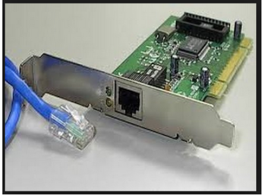
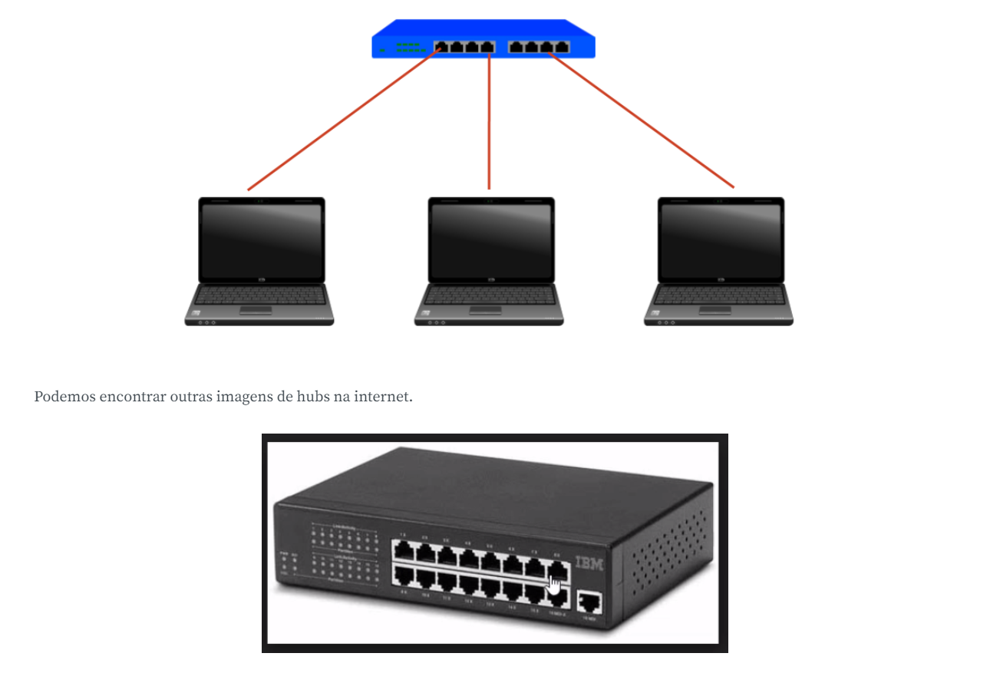

Temos falado sobre placas de rede, vamos visualizá-las para nos familiarizarmos com elas.

Vemos que temos uma entrada em que será conectado o cabinho azul que conhecemos. Mais abaixo, teremos outra imagem, desta vez com o cabo:

Eu conectei a placa de rede do computador que estou usando no curso com o laptop utilizando o cabo azul. Vamos relembrar como fizemos a interconexão do nosso projeto.

Nós conectamos os dois computadores com o cabo de rede.

computadores conectados

Mas e se precisássemos conectar um terceiro computador. A placa de rede dos dois primeiros computadores já está ocupada. Não temos mais espaço disponível para conectarmos o terceiro. Para podermos conectar diversos computadores, foram criados dispositivos que podem fazer essa conexão, um deles recebe o nome de hub.

Então, estamos na etapa de interconectar computadores. Além dos dois que nos já conectamos no curso, vamos nos conectar em um terceiro.

Relembraremos como fazíamos para colocar os endereços IPs nas máquinas.

Vamos até no ícone de conectividade, depois em "configurações de rede", "Ethernet". Em seguida, clicaremos em "Ethernet", ao ser aberta uma nova janela, selecionaremos "Propriedades".

Status de Ethernet

Será aberta uma nova janela, buscaremos pela opção "Protocolo IP Versão 4(TCP/IPv4)", depois em "Propriedades". Na nova janela, selecionaremos "Usar o seguinte endereço IP" e escreveremos o IP que ele deverá usar para fazer o teste.

Nós já configuramos com o endereço 192.168.3.2. Lembrando que não podemos ter o mesmo endereçamento IPs para máquinas diferentes. Nesta máquina, meu IP termina com 2 e a terceira máquina terminará com 3.

Faremos um teste de conectividade entre as máquinas com o IP de final 1 e 2. No terminal, digitaremos:

c:\Users\Alura>ping 192.168.3.1COPIAR CÓDIGO
Vamos ver o que acontece:

Veremos se o computador com o IP 192.168.3.3 também está ativo.

Nós conseguimos nos conectar tanto com o primeiro e como com o terceiro computador. O hub permite comunicar com os três computadores, seu papel foi desempenhado com sucesso.