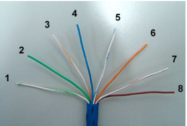
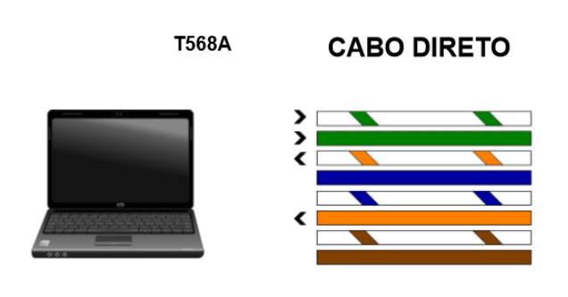
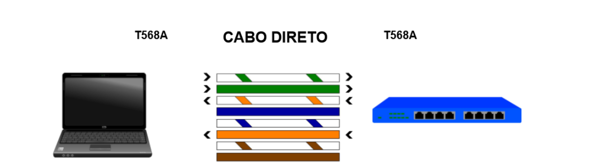
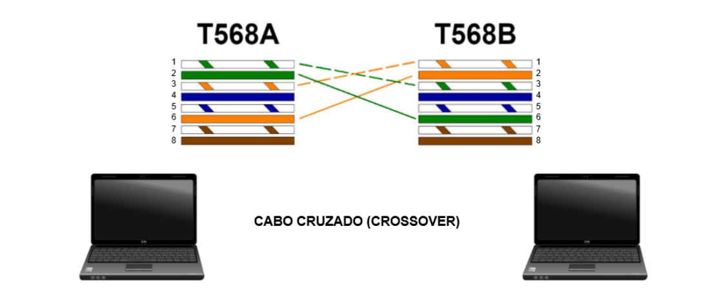

Vamos analisar os cabos que estão conectando os dois computadores diretamente e o que foi usado para conectar os três computadores com o hub. Quando compramos o cabo, ele vem do fabricante com alguns fios soltos:

Os fios soltos, são aqueles que estão internamente no cabo e depois, serão inserido no conector plástico chamado RJ45. Este processo de colocar os fios no conector plástico, chamamos de crimpar.

Em seguida, vamos analisar as cores do fios internos que temos. Nós temos as seguintes cores de cabos: verde e branco; verde; branco e laranja; azul; branco e azul; laranja; branco e marrom; e marrom.

Existe um padrão para essas cores serem seguidas: o T568A, desenvolvido pela associação internacional de Telecomunicações (Telecomunication industry association - TIA). Eles definiram o padrão de cores que deveria ser seguido. Sabendo disso, faremos a análise do nosso último projeto em que conectamos os computadores com o hub.

A placa de rede do computador transmite na posição 1 e 2, e recebe na posição 3 e 6.

O hub receberá nas posições contrárias: receberá nas posições 1 e 2, e transmitirá nas posições 3 e 6.

O computador da esquerda está transmitindo o sinal na posição 1 e 2 e recebendo na posição 3 e 6. Já o hub recebe na posição 1 e 2 e transmite o sinal nas posições 3 e 6.

Os dois estão conseguindo transmitir e receber informações. Quando seguimos a mesma sequência de cores de ambos os lados, dizemos que este é um cabo direto. O cabo está na mesma posição no computador e no hub. Vamos usar o cabo direto para comunicarmos dois computadores.

Mas o segundo computador, por possuir a mesma placa de rede, transmitirá o sinal na posição 1 e 2, e receberá na posição 3 e 6.

Se as informações dos computadores estão sendo transmitidas nas mesmas posições, por exemplo, pelo fio branco e verde, o que acontecerá?

* Acontecerá uma colisão! Os dois computadores estão transmitindo sinal na mesma posição. Precisaremos encontrar uma forma para que este problema não ocorra.

Pensando nisto, a TIA criou o padrão chamado T568B.

A diferença para o novo padrão é que os cabos terão uma sequência de cores diferentes nas duas pontas, desta forma o problema de transmissão e recebimento do sinal é corrigido. O computador da esquerda estará com a T568A, enquanto o da direita estará com o T568B.

Agora o sinal transmitido na posição 1 pelo computador da esquerda será recebido pela posição 3 da direita.
Já o sinal transmitido na posição 2 será recebido na posição 6 na placa da outra máquina.

Agora, veremos como será a comunicação do computador da direita com o da esquerda.

O sinal será enviado pelo fio branco e laranja da posição 1 e será recebido pelo fio da posição 3.

Foi atendida a primeira condição de transmissão. Vamos ver como será feita a transmissão do sinal na posição 2.

E o sinal é recebido na posição 6 do computador da esquerda.

Perceba que ocorreu um cruzamento interno dos sinais de uma forma que eles não colidam. Por causa do cruzamento, ele recebeu o nome de cabo cruzado, ou crossover.

Em uma das pontas teremos o T568A e em outra, o T568B.

Vimos que se for comunicar dois equipamentos iguais, que possuem a mesma placa de rede, os dois transmitirão o sinal no fio com a mesma posição. Se conectarmos as pontas com T568A em ambas pontas, teremos problemas nas transmissões. O mesmo ocorreria se colocássemos o T568B nas duas pontas.

Nós entraríamos em rota de colisão novamente.

Mas a conexão poderá ser feita corretamente se em um dos lados tivermos T568A e em outro o T568B, porque assim será feita a correção de qual fio irá transmitir e qual fio irá receber.

Às vezes ocorrem confusões sobre o tipo de cabo que deve ser usado, se deve ser o direto ou o cruzado. As placas de rede mais modernas conseguem perceber a diferença e fazem a correção automaticamente via software. Mas nem todas placas de rede possuem essa configuração. É melhor saber qual tipo de cabo precisamos usar.