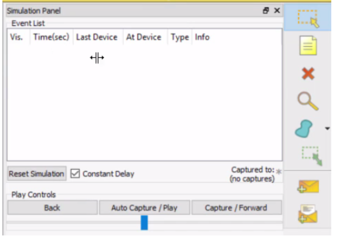
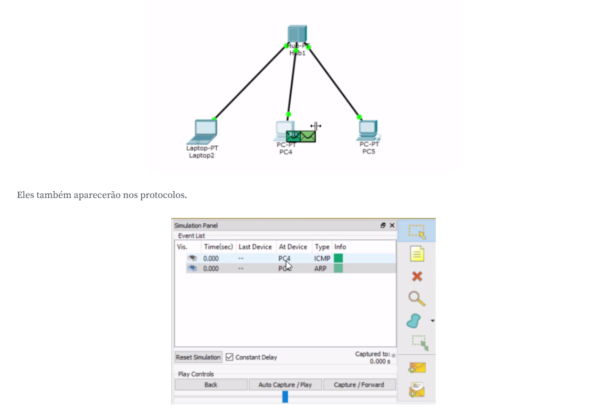
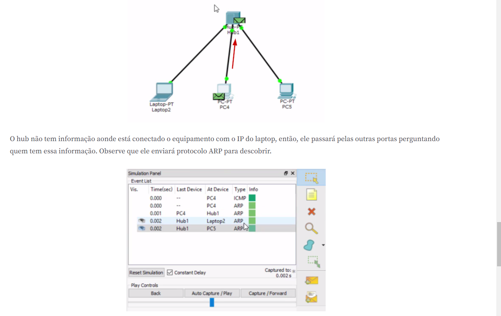

# Limitação hub

Temos no programa de simulação a rede criamos anteriormente em que temos três computadores interconectados com o hub.

Nós temos os IPs de cada uma das máquinas e agora, iremos testar a conectividade entre eles. Mesmo usando um programa de simulação, teremos que ir no Terminal como teríamos que fazer em outros casos. Mas antes, iremos quebrar em algumas etapas menores que serão analisadas. No canto direito do Packet Tracer mudaremos o modo de operação de "Realtime" para "Simulation".

Observe que surgirá a coluna "Simulation Panel".

Nela, começará a parecer alguns protocolos de rede que analisaremos. O computador "PC-PT PC4" realizará meu teste de conectividade com o "Laptop-PT Laptop 2". Clicaremos sobre o ícone, clicaremos em "Command Prompt" e digitaremos ping e o endereço IP do desktop.

Observe que agora veremos pequenos envelopes acima do ícone de reprsentação do computador.

Dentro do ping digitado no Command, teremos o protocoloco ICMP, que está aparecendo na coluna. E o que significa o ARP? A primeira vez que o computador quer se comunicar com o IP, ele não sabe onde estará localizado. É preciso perguntar para todos os dispositivos que estão na nossa rede.

Então, clicaremos em "Capture/Forward".

O hub não tem informação aonde está conectado o equipamento com o IP do laptop, então, ele passará pelas outras portas perguntando quem tem essa informação. Observe que ele enviará protocolo ARP para descobrir.

O terceiro computador recebeu a requisição e descartou a informação. Isto aconteceu, porque ele não tem o IP que estamos procurando. Estamos buscando o IP 192.168.3.1 e a terceira máquina tem o IP 192.168.3.3. Já o primeiro computador recebeu a informação e terá que devolvê-la informando sua informação.

Já sabemos que a requisição veio da segunda máquina e a terceira não deveria receber a requisição. Mas a última máquina continua recebendo informação. Esta é uma das limitações do hub: ele não consegue aprender aonde os computadores estão interconectados e sempre passará as informações para todos os dispositivos conectados com a porta, com exceção de quem enviou a requisição. O nome disso é Broadcast. Imagine um usuário fazendo o download de 500 mb e todos os dispositivos recebendo essa informação... Causa uma lentidão na rede.

Em relação ao hub, precisamos falar também sobre a segurança da informação. A requisição que fizemos entre o segundo computador e o laptop, o hub desconhece aonde está conectado o laptop. Logo, ele enviará para todos os dispositivos que estiverem conectados. Se uma das máquinas tiver um usuário malicioso, ele pode fazer o que chamamos de análise de protocolo e decifrar o que está sendo enviado pelo segundo computador. O hub representa uma lentidão, além da vulnerabilidade da segurança.