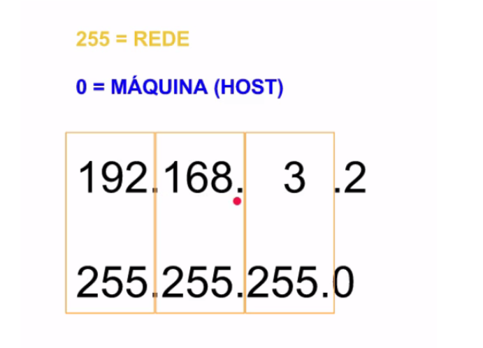
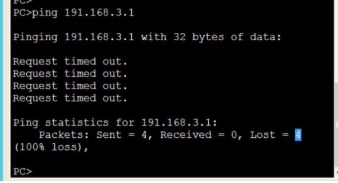

Já aprendemos como os roteadores e o Switch trabalham. Mas ainda temos algo importante para conversar. Quando vários computadores estão conectados no mesmo Switch ou no mesmo Hub, não significa que eles estão conectados na mesma rede.

Nós podemos fazer uma separação lógica de endereçamento e colocar cada computador em uma rede diferente. Mas por que faríamos isso? As máquinas podem fazer parte de diferentes setores de uma empresa e cada uma possui a sua rede, que precisa se comunicar com as outras. Na minha empresa podemos ter diferentes setores e às vezes, precisamos segmentar a rede em duas, para atender diferentes necessidades.

Primeiro ponto a se considerar é: como saberemos se o outro dispositivo está na mesma rede. Vamos analisar o segundo computador. Selecionaremos a aba "Desktop", depois em "IP configuration":

Nós só configuramos o endereço de IP, mas vemos que existe também uma "Subnet Mask" com o número 255.255.255.0. Ele surgiu automaticamente. Esta máscara de rede terá um papel crucial para descobrirmos se outra máquina está na mesma rede que a minha. Faremos esta análise em conjunto.

Temos a máscara de rede, que dividirá o endereço IP do computador em dois grandes grupos: um referente às redes e outro às máquinas.

Tudo que for 255 será referente à rede, e o que for 0 será referente ao host. Então, ele analisará o primeiro intervalo:

Então, será dito para o computador: "para outro dispositivo estar na mesma rede que você, ele precisará começar com o mesmo intervalo de octeto. Logo, ele deverá começar por 192"

Depois, ele passará para o outro intervalo: "se o mesmo dispositivo quiser estar na mesma rede, deverá ter o segundo octeto 168." E no terceiro octeto, ele dirá: "computador, se o dispositivo quiser estar na mesma rede, ele precisa ser igual a 3". Ou seja, a máscara de rede informa que para o dispositivo estar na mesma rede, ele precisará ter o IP começando com 192.168.3.

O quarto octeto ele verificará que é igual a 0 e não se importará com o valor que estiver no IP. É irrelevante o valor do quarto octeto. O que realmente importa é que ela comece com 192.168.3.

Voltaremos para o nosso projeto. Ao verificarmos, veremos que o IP dos três computadores interconectados começavam com os mesmos numeros.

Veja que não foi uma coincidência que a nossa configuração tenha colocado os três intervalos iguais. O objetivo é que todas estivessem na mesma rede. Isto significa, que se alterarmos qualquer um dos três octetos, eles já não estarão na mesma rede e a comunicação entre eles já não será possível. Vamos fazer um teste, alterando o número de IP da primeira máquina. O primeiro octeto deixará de ter o valor 192 e passará a ter o valor 191.

Faremos agora, um teste de conectividade digitando:

~~~
ping 191.168.3.1
~~~

Receberemos o seguinte retorno:

Perguntamos na rede quem era dona do IP 191.168.3.1 e a conexão não foi estabelecida. Ninguém respondeu, porque estamos utilizando uma rede diferente. Com o hub nós só conseguimos comunicar com os computadores que estão na mesma rede.

Foram enviados quatro pacotes. Também perdemos a mesma quantidade de pacotes. Ou seja, enviamos a requisição para o IP, mas pelo fato de este estar em uma rede diferente, não foi possível a conexão.

Mais adiante veremos como resolver o problema.

