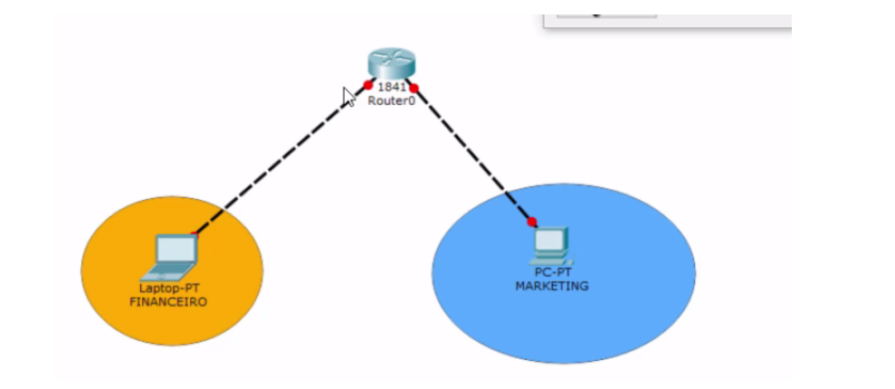

# Roteador

Para conseguir fazer com que os dois computadores se comuniquem, precisaremos de um equipamento de rede chamado roteador. A função dele será conectar computadores de redes diferentes.

No nosso projeto, deletaremos o Switch e substituiremos por um roteador ("Router") na opção de ícones de equipamentos no Packet Tracer. Excluiremos também o terceiro computador que não será mais usado no projeto.

E como será feita a conexão entre o roteador e os computadores? Precisaremos primeiramente descobrir se os dois computadores são iguais. Caso eles sejam, significa que eles terão a mesma placa de rede. No exemplo, nós conectaremos um laptop e um computador com o roteador. Ou seja, não estamos conectando equipamentos iguais.

Faremos uma nova pergunta: a conexão que faremos irá explorar a totalidade que o equipamento foi projetado para fazer? Por exemplo, um computador foi projetado para se comunicar com várias máquinas. Já o roteador foi projetado para interconectar redes diferentes. Se conectarmos o laptop com um roteador, exploraremos tudo o que os dispositivos podem fazer? Não. Ele não explora. Um setor poderia ainda ter outras máquinas de um mesmo setor que não estariam conectadas com o roteador.

Por isso, neste caso, utilizaremos o cabo cruzado (crossover). Vamos adicioná-lo no projeto e remover os computadores usados rapidamente no exemplo anterior. Selecionaremos o ícone do raio e será aberta uma lista de cabos. O correto será a quarta opção listada.

Nós colocamos na porta disponível "FastEthernet0/0". Depois, faremos a conexão entre o computador e o roteador.

Agora, criaremos a segmentação por setores da empresa. No menu da direita, selecionaremos o ícone do circulo. Será aberta uma nova janela que nos permitirá escolher a cor. Escolheremos a cor laranja e vamos adicionar o círculo ao projeto.

O círculo laranja estará representando a rede do financeiro. Em seguida, criaremos outro círculo que representará a parte de Marketing.

A instalação do projeto já foi feita, agora falta a configuração do roteador. Faremos isto logo adiante.